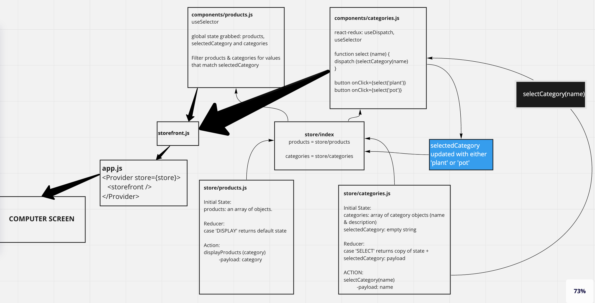

# Redux - Virtual Store 
This is a React-Redux app that uses Material UI to handle component styling.

## Virtual Store
Products are stored in memory and state is store using a Redux Store.  In this app, users are able to select a category of product to make products within that category render.  No real copy or content is being used for these products and an unsplash.com randomizer is used to generate images on the cards.

In the category reducer, the initial state of selectedCategory is an empty object.  Clicking on a category updates that state (using the category reducer).  Then, products are rendered based on whether or not their product category matches the name value in selectedCategory.

## UML Model

